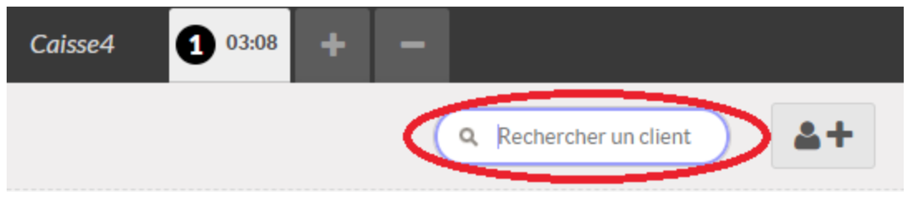

I. Effectuer un passage en caisse 

1) Sélectionner le membre
 IMPORTANT : Avant de scanner le badge du membre, cliquer dans le champ “Rechercher un client”.

Scanner la carte de la personne avec la douchette

Si cela ne marche pas, entrer le nom du membre dans la barre “Rechercher un client” 
Cliquer sur son nom lorsqu’il s’affiche.

Cliquer sur “Définir le client”

2) Scanner le code barre
Le produit apparaît dans le panier à gauche de l’écran 

Il est inutile de prendre la douchette en main, elle scanne les produits passant devant son champ. 
IMPORTANT : La douchette est très sensible et peut enregistrer 2x le même produit. (Surveiller ce qui s’inscrit à l’écran). 
IMPORTANT : Quand un code de barre ne passe pas le message suivant s’affiche : 

Cliquer sur ok et chercher le produit dans la barre de recherche 

ATTENTION, lorsque le message “code barre inconnu” s’affiche,NE PLUS UTILISER LA DOUCHETTE car elle continue de biper mais les produits ne sont pas enregistrés dans le panier !!!!

3) Supprimer un élément du panier
Vérifier que le bouton Qté (Quantité) est bien en VERT

Puis cliquer sur le bouton suivant : 

ATTENTION, Il faut parfois appuyer plusieurs fois sur le bouton. Il arrive également qu’en cliquant trop vite, on supprime l’article précédent !

4) Effectuer une remise
A La Cagette, on applique une remise de 20% pour les produits périmant
Le jour même
Le lendemain

IMPORTANT : Se renseigner avant son créneau sur les éventuelles remises en caisse !

Sélectionner le produit
Cliquer sur le bouton VERT  “Rem”
Taper le montant de la remise en pourcentage.
Exemple : Pour une réduction de 20%, tapez 20

5) Retour des bidons consignés
Taper consigne dans la barre de recherche et choisir le bidon 
6) Passer au paiement
Pour procéder au paiement
Cliquer sur paiement (En bas à gauche). 

Demander au membre son mode de paiement (Espèces, Chèque ou Carte Bancaire) 
Cliquer sur le bouton correspondant à gauche

6) a) Les Chèques
Les chèques sont à faire à l’ordre de LA CAGETTE 
Le champ “Offert” indique directement le montant du chèque (vérifier le montant, l’ordre et la signature !)
Cliquer alors sur le bouton Valider

La caisse ne s’ouvre pas ! C’est normal puisqu’il n’y a pas de monnaie à rendre.
Glisser le chèque dans la fente en bas du tiroir caisse 
Cliquer enfin sur le bouton VERT “Passer à la Commande suivante”

6) b) Les espèces 
ATTENTION :  la caisse va s’ouvrir toute seule à la fin de la manipulation, ne rien laisser sur le dessus !
Saisir dans le champ “Offert” les espèces données par le client.

La monnaie à rendre est calculée automatiquement dans le champ “Change”. 

Cliquer alors sur le bouton Valider 

Le ticket s’imprime et la caisse s’ouvre !
Rendre la monnaie puis déposer l’argent donné 
Donner le ticket de caisse au membre

Cliquer enfin sur le bouton VERT “Commande suivante”

6) c) La Carte Bancaire
ATTENTION : ne pas cliquer sur le bouton VERT “valider” (sur l’écran d’ordinateur) tant que le paiement n’a pas été accepté. En effet en cas de refus de la carte par exemple, il faudra changer de moyen de paiement !

Une fois ce mode de paiement choisi, le montant s’affiche directement sur le boîtier CB en principe, sinon le taper sans virgule

La personne insère sa carte, fait son code et valide. Le ticket sort.

Couper le premier ticket à remettre au membre
Appuyer sur “valider” de nouveau pour le sortir le 2nd ticket
Rendre la CB
Ranger le second ticket sur le “pic”prévu à cet effet
          

       
 Attention : Si le ticket ne sort pas :
Vérifier qu’il y a encore du papier (les recharges sont dans le meuble d’angle derrière les caisses 1 et 2)
Appuyer sur le boitier sur la touche F puis 1, sélectionner DUPLICATA puis TRANSACTION et VALIDER avec le bouton VERT
Sur la machine qui propose le paiement sans contact à la caisse 2
 Pour une CB normale :
Appuyer sur F puis 1 puis choisir 3 duplicata puis 1 carte puis 1 commerçant et 2 client
Pour une CB sans contact :
appuyer sur F puis 2 puis choisir 3 duplicata puis 1 carte puis 1 commerçant et 2 client

6) d) Pour imprimer le ticket de caisse du membre
Cliquer alors sur le bouton VERT Valider

Cliquer enfin sur le bouton VERT “Passer à la Commande suivante”

A savoir : Tant que le paiement n’est pas validé, il est possible de changer le mode de paiement en revenant sur le ticket du client : cliquer sur close / confirmer / reprendre.

